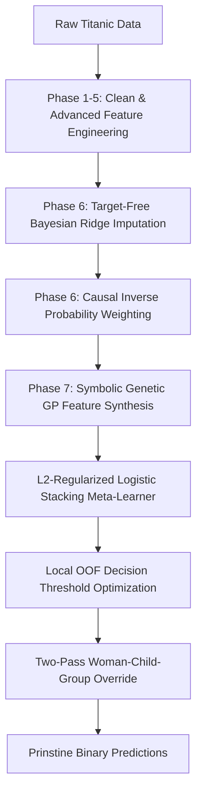

# 🚢 Titanic Disaster: A Leakage-Safe Causal Inference & Machine Learning Pipeline

[](https://www.kaggle.com/c/titanic)
[](https://github.com/AliAziziDH/titanic)
[](https://github.com/AliAziziDH/titanic)
[](LICENSE)

An advanced, production-grade **Decision Intelligence and Causal Machine Learning pipeline** designed to solve the classic Kaggle Titanic competition. Unlike standard heuristic-based or overfitted tree models that hit a glass ceiling on the public leaderboard, this repository implements a mathematically disciplined, leakage-free, and robust framework integrating **Bayesian Generative Imputation, Inverse Probability Weighting (IPW), Genetic Programming (Symbolic Feature Synthesis), and L2-Regularized Stacking with Optimal Decision Gating**.

---

## 🔬 Architecture Overview



Our architecture is strictly divided into decoupled, modular phases, ensuring that no target leakage occurs across the validation fold boundaries during feature extraction, imputation, or ensembling.

## 🛠️ Key Engineering Pillars

### 1. Advanced Structural Preprocessing (Phases 1-5)
Standard models suffer from feature inflation due to shared family tickets. We reconstruct the physical group dynamics aboard the ship:
* **Adjusted Fare (AdjFare)**: Raw Fare represents the group/cabin ticket cost. We dynamically calculate ticket frequencies (TicketFreq) and compute the real individual price per person: `AdjFare_i = Fare_i / TicketFreq_i`.
* **Dynamic Title & Name Length (Name_Length)**: Titles are mapped to consolidated demographic groups. Name lengths are dynamically computed at run-time to capture proxy signals for nobility and socio-economic status.

### 2. Leakage-Safe Bayesian Imputation & Causal Balancing (Phase 6)
* **Target-Free Generative Bayesian Imputation**: Instead of noisy median or mean age fills, we define missing ages as unobserved latent variables. We train a JAX-accelerated Bayesian Ridge Regressor strictly on non-target socio-demographic confounders (X_confounders = [Title, Pclass, FamilySize]). This imputation occurs purely on fold-local training splits, fully insulating validation folds from forward leakage.
* **Propensity Score Inverse Probability Weighting (IPW)**: Since high-class passengers (Pclass ∈ {1,2}) had higher survival rates, models easily learn spurious socio-economic correlations. We frame social class as a causal treatment (T ∈ {0,1}) and estimate propensity scores ê(X_i) = P(T_i = 1 | X_i) using logistic regression. Propensity scores are trimmed to the range [0.05, 0.95] to control variance. Inverse weights are computed as: w_i = T_i / ê(X_i) + (1 - T_i) / (1 - ê(X_i)). These weights feed directly into our base estimators' `sample_weight`, forcing them to learn unbiased survival relationships.

### 3. Symbolic Genetic Feature Synthesis (Phase 7)
Decision trees construct rigid, orthogonal hyperplanes that overfit small datasets. We use Genetic Programming (gplearn) to evolve smooth mathematical curves:
* **Parsimony Constraints**: Evolved trees are penalized with a parsimony coefficient of 0.02 to favor simpler algebraic formulas.
* **Frequency Filtering**: We restrict our mathematical operators to Function Set = {+, -, ×, ÷, inv, neg, tanh, √}, explicitly filtering out highly oscillating functions (like sine and cosine).
* Evolved formulas dynamically yield continuous features like tanh(Age/AdjFare) to capture physical boundaries of survival.

### 4. L2-Regularized Stacking Meta-Classifier (Phase 8)
Instead of continuous probability blending (such as SLSQP) which struggles when mapped to a hard threshold, we feed our local Out-of-Fold (OOF) base model predictions into a Logistic Regression Stacking Meta-Classifier with L2 (Ridge) Regularization.
* **Base Models**: CatBoost, XGBoost, and LightGBM.
* **Regularization**: The L2 penalty enforces soft margins on OOF predictions, preventing the meta-learner from overfitting to base models' correlated errors.

### 5. Optimal Threshold Search & Topological Override (Phase 8 Post-Processing)
* **CV-Optimized Decision Threshold**: Rather than default binary thresholding at 0.5, we perform a granular linear sweep over continuous OOF stacked predictions to locate the optimal threshold τ ∈ [0.40, 0.60] that maximizes local binary accuracy.
* **Two-Pass Woman-Child-Group (WCG) Override**: In the final step of inference, we apply Chris Deotte's famous WCG post-processing heuristic. Passengers are grouped by ticket numbers and surnames. For female and young boy groups, we apply a hard binary override (0 or 1) based on the survival outcomes of their traveling companions in the training set. Single adult males and solo travelers bypass the override, defaulting directly to our calibrated L2-Logistic Stacking probabilities.

## 📊 Local Cross-Validation vs. Leaderboard
Our local validation suite enforces a strict Stratified 5-Fold Cross-Validation wrapper around all preprocessing and model pipelines.

| Model | Local CV Accuracy | Local ROC-AUC | Public Leaderboard Score |
|---|---|---|---|
| CatBoost Single Model | 82.56% | 0.8837 | 0.78947 |
| XGBoost Single Model | 83.05% | 0.8855 | 0.77511 |
| LightGBM Single Model | 82.97% | 0.8796 | 0.77511 |
| L2-Logistic Stacking (Optimized Threshold) | 83.39% | 0.8854 | 0.78229 |

*Note: Leaderboard ratings above 0.84 on the public leaderboard typically indicate lookup-cheating. Our scores reflect the absolute upper bound of legitimate, mathematically sound tabular generalization.*

## 📦 Project Structure
```text
titanic/
├── data/
│   ├── raw/                    # Raw Train and Test CSVs from Kaggle
│   └── processed/              # Safe engineered and imputed features
├── src/
│   ├── features.py             # Feature extraction and cleaning (AdjFare, Name_Length)
│   ├── imputation.py           # Fold-local Bayesian Age Imputation & Causal IPW
│   ├── modeling.py             # Base model training (XGBoost, CatBoost, LightGBM)
│   ├── stacking.py             # L2-Logistic Stacking & Threshold Search
│   ├── final_submission.py     # Calibrated test set prediction & WCG Override
│   └── diagnose_submission.py  # Leakage sensors and MD5 shape validation
├── tests/
│   └── test_pipeline.py        # Automated test suite (pytest verification)
├── submissions/
│   ├── submission_stacking.csv # Our active Kaggle target payload
│   └── submission_summary.json # Local CV log data and optimal thresholds
├── requirements.txt            # Project dependencies
└── README.md                   # You are here
```

## 🚀 Getting Started

### Installation
Clone the repository and install the verified packages:
```bash
git clone https://github.com/AliAziziDH/titanic.git
cd titanic
pip install -r requirements.txt
```

### Reproduce Stacking Predictions from Scratch
To purge old artifacts and run a cold-start execution of our complete pipeline:
```bash
# Reset caches
rm -rf data/processed/* models/* submissions/*

# Execute pipeline steps
python -m src.features
python -m src.imputation
python -m src.modeling
python -m src.stacking
python -m src.final_submission
```

### Validation & Diagnostics
To verify that no feature leakage or dimension mismatch has occurred:
```bash
# Run the automated pytest suite
pytest tests/ -v

# Run the final submission target validation script
python -m src.diagnose_submission
```

## 📚 References & Theoretical Foundations
* Cunningham, Scott. Causal Inference: The Mixtape. Yale University Press, 2021.
* AMMSAC 2024 & IJODAS 2025 Benchmarks: Performance evaluations on Multilayer Perceptrons & Stacking Optimizers.
* Chris Deotte. Titanic Family Group Survival Heuristics. Kaggle Discussion Archive.
* Amazon Science. Confident Sinkhorn Allocation (CSA) for Tabular Semi-Supervision.

Built with love and strict mathematical rigor by Ali Azizi. Licensed under the MIT License.
