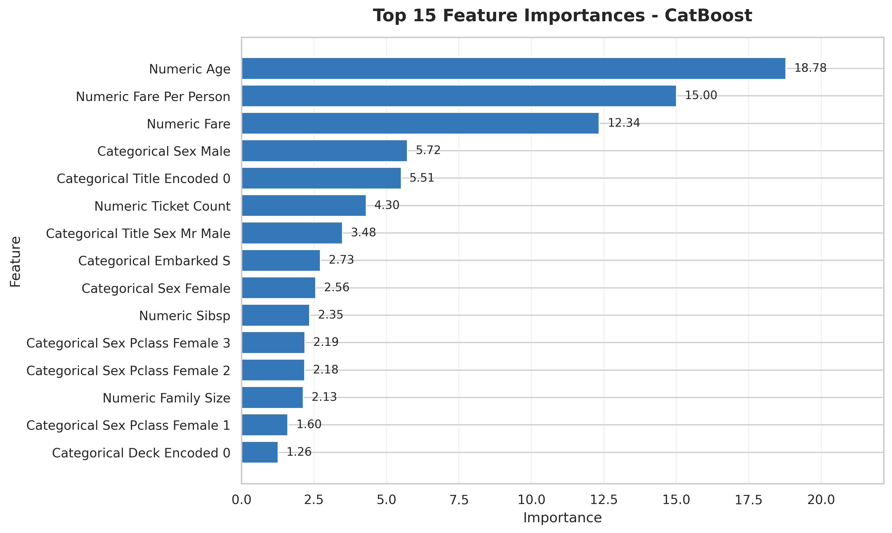
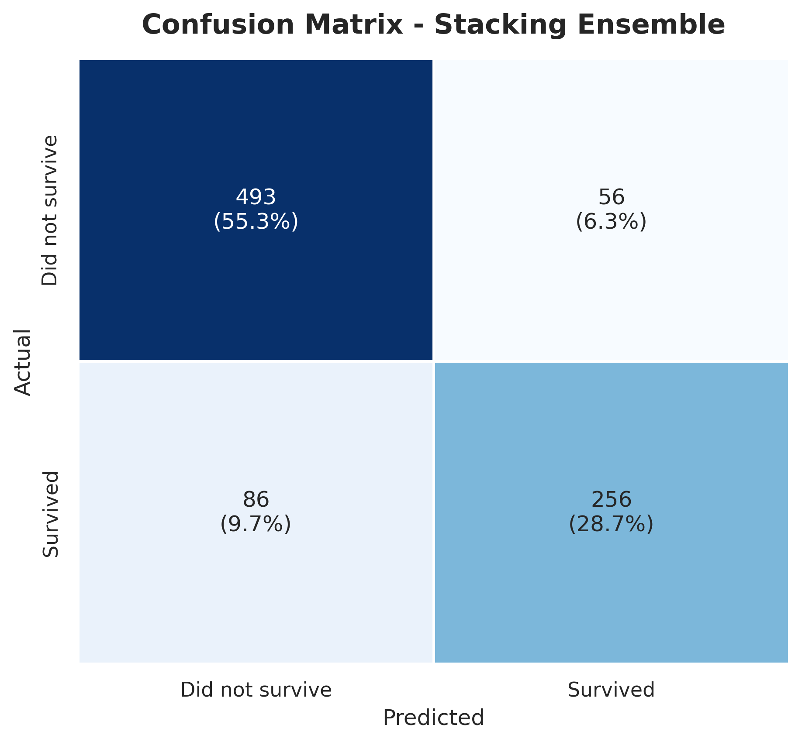
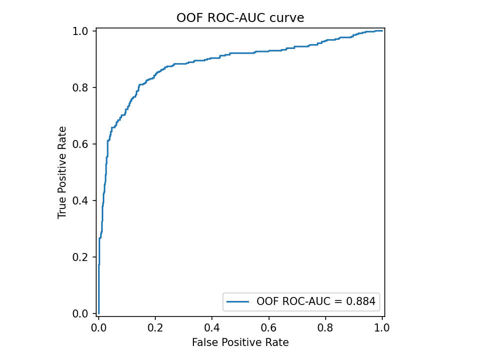
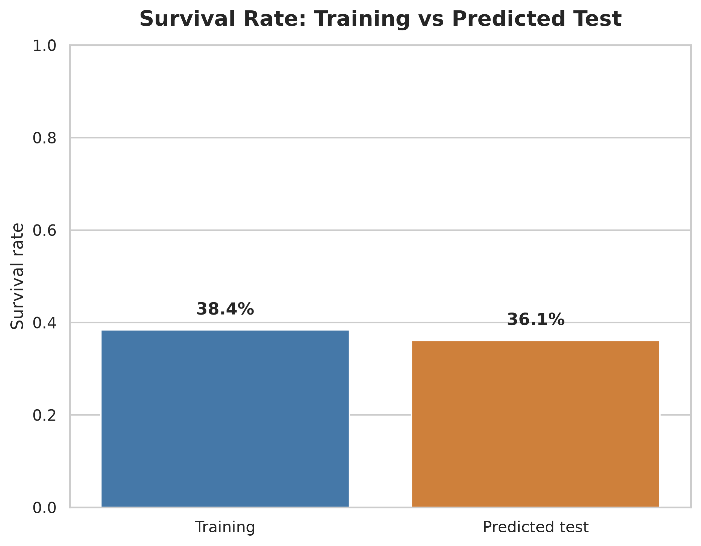

# Titanic: From Raw Data to a Leakage-Aware Ensemble

An end-to-end, modular solution for the [Kaggle Titanic competition](https://www.kaggle.com/competitions/titanic).

[](https://www.python.org/)
[](https://www.kaggle.com/competitions/titanic)
[](#license)

## Table of Contents

- [Overview](#overview)
- [Results](#results)
- [Methodology](#methodology)
- [Project Structure](#project-structure)
- [Installation](#installation)
- [Usage](#usage)
- [Visual Reports](#visual-reports)
- [Lessons Learned](#lessons-learned)
- [Author](#author)
- [License](#license)

## Overview

The objective is simple: predict whether a passenger survived the Titanic disaster. The
engineering challenge is to turn a small, mixed-type historical dataset into a reliable,
reproducible machine-learning workflow.

This project deliberately treats validation and leakage prevention as first-class
requirements. Every transformation used by a model is placed inside a pipeline or fitted
only from training data. The workflow is reproducible through a fixed seed of `42`.

## Results

### Individual models

| Model | Repeated-CV ROC-AUC | Repeated-CV Accuracy |
| --- | ---: | ---: |
| CatBoost | **0.8875** | **0.8335** |
| RandomForest | 0.8811 | 0.8301 |
| XGBoost | 0.8713 | 0.8155 |
| LightGBM | 0.8646 | 0.8081 |

### Stacking ensemble

The stacker combines CatBoost, LightGBM, RandomForest, and a regularized MLP through a
Logistic Regression meta-model trained on out-of-fold probabilities. In the current
feature configuration, the standalone CatBoost candidate has the strongest local
accuracy and fold-mean ROC-AUC, so `submission_catboost.csv` is the recommended file
to try first; `submission_stacking.csv` remains available for comparison.

- OOF ROC-AUC: **0.8882**
- OOF accuracy: **0.8339**
- OOF macro-F1: **0.8201**
- Latest public Kaggle leaderboard scores:
  - `submission_catboost.csv`: **0.77511**
  - `submission_weighted_ensemble.csv`: **0.77511**
  - `submission_majority_vote.csv`: **0.77511**
  - `submission_stacking.csv`: **0.77033**

The leaderboard scores were returned by Kaggle on 2026-07-31. They are external
evaluations of specific submission files, while the OOF metrics are the reproducible
local validation results saved in `experiments/`. Public scores can change with a
different feature, threshold, or submission artifact, so they should not be treated
as a replacement for local validation.

## Methodology

### 1. EDA: understanding the passenger data

The analysis began with shapes, dtypes, distributions, missingness, duplicates, and
train/test comparisons. `Cabin` was missing for roughly 77% of training rows, `Age` for
roughly 20%, and `Embarked` for only two rows.

The main challenge was distinguishing noise from useful signal. Survival varied strongly
by sex and passenger class, while names, cabin letters, tickets, and family structure
provided additional context.

### 2. Feature engineering: turning context into variables

The feature pipeline extracts:

- `Title` and `Title_Encoded` from `Name`
- `Deck`, `Deck_Encoded`, `Deck_Group`, and `Has_Cabin` from `Cabin`
- `Family_Size`, `Is_Alone`, and `Family_Size_Category`
- `Ticket_Count`, `Is_Group`, and `Ticket_Prefix`
- `Fare_per_Person` and `Fare_Bin`
- `Sex_Pclass`, `Title_Sex`, `Is_Mother`, and `Age_Band`

The raw `Name`, `Ticket`, and `Cabin` columns are removed after extraction. No target
column is used to construct features.

### 3. Imputation: filling missing values without shortcuts

The standalone data-preparation command can predict missing Age values with a
`RandomForestRegressor`, using demographic and ticket-derived features. For model
validation, however, the modeling and stacking commands deliberately consume the
engineered data before materialized imputation: `SimpleImputer`, scaling, and encoding
are fitted inside each training fold and then applied to that fold's validation rows.
This keeps Age and all other preprocessing statistics inside the validation boundary.
The final-submission utility may materialize clean data for inference, where it is
fitted using the complete training set only. Fare uses a train-derived conditional
median by class and embarkation, while Embarked uses class and fare logic with a mode
fallback.

The important lesson is that an imputer is part of the model, not a preliminary step
that can inspect all data indiscriminately.

### 4. Modeling: a reproducible baseline

Each candidate model uses a `ColumnTransformer` with median numeric imputation,
standardization, categorical imputation, and one-hot encoding. The complete
preprocessing-and-model pipeline is refitted inside every validation fold.

CatBoost was the strongest individual model. XGBoost, LightGBM, and RandomForest added
useful diversity despite slightly lower individual scores.

### 5. Stacking: learning from honest predictions

For each fold, every base model is trained on the fold's training rows and produces
probabilities for the held-out rows. These out-of-fold (OOF) probabilities form the
meta-model training matrix. The base models are then refitted on all training data for
test predictions.

This avoids the common stacking failure mode where a meta-model learns from
predictions made on the same rows used to fit a base model.

### 6. Interpretation and sanity checks

SHAP analysis checks both importance and direction. Sex, title, and class are expected
to be influential; female passengers should generally receive positive survival
contributions, while `Mr` and higher class numbers should generally contribute
negatively. Error analysis groups mistakes by class, sex, age band, and embarkation.

Interpretation is treated as a validation layer: a high score is not enough if the
model is relying on an accidental identifier or implausible signal.

### 7. Final submission

The final submission utility validates the Kaggle schema, thresholds probabilities at
0.5, preserves `PassengerId`, and writes individual, stacking, weighted-ensemble, and
majority-vote candidates when their model artifacts are available.

## Project Structure

```text
titanic/
├── src/
│   ├── config.py
│   ├── eda.py
│   ├── features.py
│   ├── imputation.py
│   ├── modeling.py
│   ├── stacking.py
│   ├── tune_hyperparams.py
│   ├── interpret.py
│   ├── generate_readme_figures.py
│   └── final_submission.py
├── data/
│   ├── raw/
│   └── processed/
├── models/
├── experiments/
├── reports/
│   └── figures/
├── submissions/
│   ├── submission_catboost.csv
│   ├── submission_stacking.csv
│   └── submission_summary.json
├── requirements.txt
└── README.md
```

Large/generated data, model binaries, caches, and figures are excluded from version
control where appropriate by `.gitignore`.

## Installation

```bash
git clone https://github.com/AliAziziDH/titanic.git
cd titanic
python -m venv .venv
source .venv/bin/activate  # Windows: .venv\Scripts\activate
pip install -r requirements.txt
```

Place Kaggle's `train.csv` and `test.csv` in `data/raw/` for a local run. The code
automatically uses `data/raw/` when both files are present and otherwise falls back to
the Kaggle directory `/kaggle/input/competitions/titanic/`.

## Usage

Run the stages in order:

```bash
python -m src.eda
python -m src.features
python -m src.imputation
python -m src.modeling
python -m src.stacking
python -m src.interpret
python -m src.final_submission
```

`modeling.py` and `stacking.py` create the required model artifacts locally; binary
model files are intentionally excluded from GitHub. They load `train_engineered.csv`
and `test_engineered.csv` (or rebuild them from `data/raw/`) so fold-level
preprocessing remains leakage-aware. Run those stages before `interpret.py` or
`final_submission.py` on a fresh clone.

Generate the README visual reports:

```bash
python -m src.generate_readme_figures
```

Submit the preferred candidate with the Kaggle CLI:

```bash
kaggle competitions submit -c titanic \
  -f submissions/submission_catboost.csv \
  -m "Feature-enriched CatBoost"
```

## Visual Reports

The repository contains code to regenerate the figures from the saved data and model
artifacts. Run `python -m src.generate_readme_figures` whenever the model or data is
updated.









## Lessons Learned

- Feature engineering based on passenger context was more valuable than blindly
  increasing model complexity.
- OOF predictions are essential for a trustworthy stacking ensemble.
- Imputation and preprocessing must be fitted within the validation boundary.
- Train/test schema and feature semantics must remain identical at inference time.
- SHAP and grouped error analysis make model behavior easier to challenge and improve.
- A leaderboard score should be interpreted alongside robust local validation, not as a
  substitute for it.

## Author

**Ali Azizi Deh Sorkh**  
Industrial Engineer | Data Science & Optimization Enthusiast

- GitHub: [AliAziziDH](https://github.com/AliAziziDH)
- Kaggle: [aliazizi1](https://www.kaggle.com/aliazizi1)
- Email: aliazizi.academy@gmail.com

## License

This project is released under the MIT License.

---

Built with disciplined validation, reproducibility, and an obsession with data leakage.
